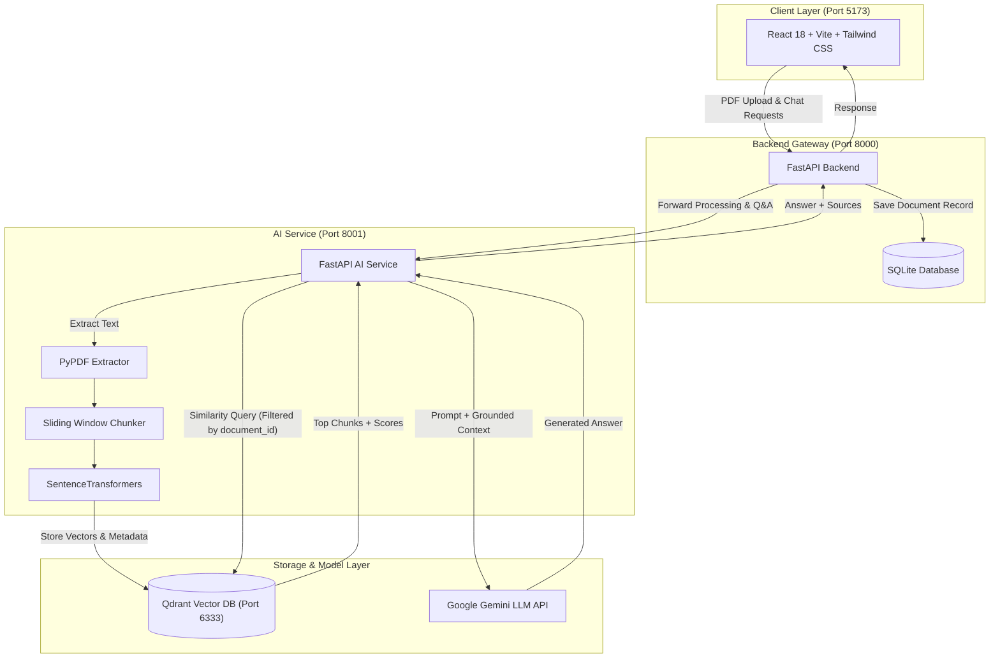

# KnowledgeHub AI — Document Intelligence & RAG Workspace

> A production-minded Retrieval-Augmented Generation (RAG) workspace built with **React**, **FastAPI**, **Qdrant Vector Database**, and **Google Gemini**.


---

## 📌 Overview

**KnowledgeHub AI** turns PDF documents (resumes, technical specifications, research papers, legal documents) into grounded, conversational AI workspaces. 

Instead of relying on LLM hallucinations, KnowledgeHub AI extracts, chunks, and vectorizes your PDFs into **Qdrant**, retrieves the most mathematically relevant text passages using vector similarity search, and passes them as grounded context to **Google Gemini**.

---

## 📐 System Architecture



---

## ✨ Key Features

* 📄 **PDF Ingestion & Drag-and-Drop Dropzone**: Upload PDF documents up to 50MB with instant type validation and progress tracking.
* ✂️ **Sliding-Window Text Chunking**: 1,000-character chunks with 200-character overlap to preserve semantic context across boundary splits.
* 🧠 **Vector Embeddings & Qdrant Storage**: Generates 384-dimensional dense vector representations stored in Qdrant with payload metadata (`document_id`, `filename`, `page`, `chunk_index`).
* 🔒 **Document-Scoped Vector Search**: Metadata filtering (`FieldCondition`) ensures vector queries are strictly scoped to the active `document_id` to prevent cross-document leakage.
* 🤖 **Grounded Gemini LLM Generation**: Combines top vector matches as context for Gemini to deliver accurate answers.
* 🏷️ **Clean Source Citation Cards**: Displays retrieved document source metadata including **Filename**, **Page Number**, and **Similarity Match Percentage** (`%`).
* 🎨 **Light Editorial UI**: Crafted with a Poppins type scale, paper background (`#F8F8F5`), responsive drawer navigation, and clean Markdown rendering.

---

## 🛠️ Tech Stack

| Layer | Technology | Description |
| :--- | :--- | :--- |
| **Frontend** | React 18, TypeScript, Vite 5, Tailwind CSS v3 | Light editorial workspace UI |
| **Backend Gateway** | FastAPI, SQLAlchemy, SQLite, Uvicorn | Port 8000 API Gateway & database persistence |
| **AI Microservice** | FastAPI, PyPDF, SentenceTransformers, Google GenAI SDK | Port 8001 RAG engine & document processor |
| **Vector Database** | Qdrant | Port 6333 high-performance vector search engine |
| **LLM Provider** | Google Gemini (`gemini-2.5-flash` / `gemini-flash-latest`) | Contextual answer generation |

---

## 📁 Repository Structure

```
KnowledgeHub-AI/
├── ai-service/                # RAG Engine & AI Microservice (Port 8001)
│   ├── app/
│   │   ├── api/
│   │   │   ├── documents.py   # PDF text extraction, chunking & Qdrant indexing
│   │   │   └── chat.py        # Vector similarity search & Gemini RAG generation
│   │   └── services/
│   │       ├── pdf_service.py # PyPDF page extractor
│   │       ├── chunk_service.py # Sliding window chunking algorithm
│   │       ├── embedding_service.py # Vector embedding generator
│   │       ├── vector_service.py # Qdrant client & metadata queries
│   │       └── llm_service.py # Gemini API integration
│   ├── main.py                # AI Service entrypoint
│   └── requirements.txt
│
├── backend/                   # Gateway API & Database Persistence (Port 8000)
│   ├── app/
│   │   ├── api/
│   │   │   └── documents.py   # Document upload, DB storage & AI proxy
│   │   ├── models/
│   │   │   └── document.py    # SQLAlchemy Document model
│   │   └── database.py        # SQLite Session setup
│   ├── alembic/               # Database migrations
│   ├── main.py                # FastAPI gateway entrypoint with CORS
│   └── requirements.txt
│
└── frontend/                  # React Workspace UI (Port 5173)
    ├── src/
    │   ├── components/        # Header, Sidebar, ChatContainer, SourcesList, Dropzone
    │   ├── hooks/             # useDocuments, useDocumentUpload, useChat
    │   ├── services/          # Centralized Axios API client
    │   ├── types/             # Document & Chat TypeScript interfaces
    │   ├── App.tsx
    │   └── main.tsx
    ├── package.json
    └── vite.config.ts
```

---

## 🚀 Getting Started

### 1. Prerequisites
* **Python**: 3.10+ (Python 3.12 recommended)
* **Node.js**: v18+ (Node 24 / npm 10+ supported)
* **Qdrant**: Running locally on port 6333 (Docker or binary)
* **Google Gemini API Key**: Set in `ai-service/.env`

---

### 2. Setting Up Qdrant Vector Database

Start Qdrant via Docker:
```bash
docker run -p 6333:6333 -p 6334:6334 qdrant/qdrant
```

---

### 3. Setting Up & Running AI Service (Port 8001)

```bash
cd ai-service
python -m venv venv312
.\venv312\Scripts\Activate.ps1   # On Windows (or source venv312/bin/activate on Linux/Mac)
pip install -r requirements.txt
```

Create `.env` in `ai-service/`:
```env
GEMINI_API_KEY=your_google_gemini_api_key_here
```

Start AI Service:
```bash
uvicorn main:app --port 8001 --reload
```

---

### 4. Setting Up & Running Backend Gateway (Port 8000)

```bash
cd backend
python -m venv venv
.\venv\Scripts\Activate.ps1       # On Windows (or source venv/bin/activate on Linux/Mac)
pip install -r requirements.txt
```

Create `.env` in `backend/`:
```env
DATABASE_URL=sqlite:///./sql_app.db
```

Start Backend Gateway:
```bash
uvicorn main:app --port 8000 --reload
```

---

### 5. Setting Up & Running Frontend UI (Port 5173)

```bash
cd frontend
npm install
```

Create `.env` in `frontend/`:
```env
VITE_API_BASE_URL=http://localhost:8000
```

Start Frontend Dev Server:
```bash
npm run dev
```

Open `http://localhost:5173` in your browser!

---

## 📡 API Endpoints

### Backend Gateway (`http://localhost:8000`)
* `GET /documents/` — List all indexed documents from SQLite.
* `POST /documents/upload` — Save PDF, create DB record, forward file to AI service for Qdrant indexing.
* `POST /documents/chat/ask` — Proxy question to AI service & return grounded response with source citations.
* `GET /ai-health` — Check health status of downstream AI service.

### AI Service (`http://localhost:8001`)
* `POST /documents/process?document_id={id}` — Extract pages, chunk text, generate embeddings, store in Qdrant.
* `POST /chat/ask?document_id={id}&question={q}` — Query Qdrant vectors with metadata filter & generate Gemini answer.
* `GET /health` — Returns `{"status": "healthy"}`.

---


## 👨‍💻 Author

Built as a Production-Grade RAG Learning Showcase. Feel free to star ⭐️ the repository and contribute!

