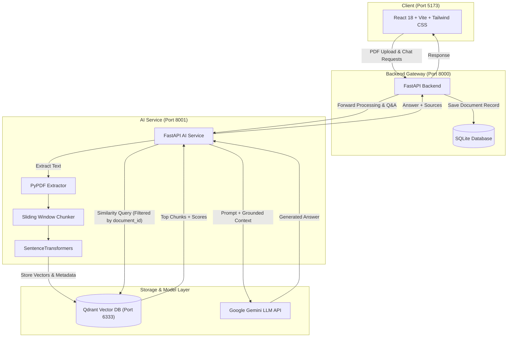

<div align="center">

# 📚 KnowledgeHub AI

**Upload a PDF. Ask it questions. Get answers backed by the document itself.**

A document intelligence workspace I built to learn how RAG (Retrieval-Augmented Generation) really works, one piece at a time.


</div>

---

## 👋 Why I built this

Most RAG tutorials stop at "call an LLM API with some text". I wanted to understand what happens before that call: how a raw PDF becomes searchable, how the right passages get found, and why answers go wrong when they don't.

So I built the whole pipeline myself. You can drop in a resume, a technical spec, a research paper or a legal document, then chat with it. Instead of letting the model guess, KnowledgeHub AI splits your PDF into chunks, stores them in **Qdrant**, finds the passages closest in meaning to your question, and hands only those to **Google Gemini** to answer from.

Every answer comes with its sources (filename, page number and a similarity percentage), so you can check where it came from.

## 🧭 Contents

[What it does](#-what-it-does) · [How it works](#-how-it-works) · [What I learned](#-what-i-learned) · [Tech stack](#-tech-stack) · [Project structure](#-project-structure) · [Run it locally](#-run-it-locally) · [API reference](#-api-reference)

---

## ✨ What it does

- **Easy PDF upload.** Drag and drop files up to 50 MB, with instant type checks and a progress indicator.
- **Smart chunking.** Text is cut into 1,000-character pieces with a 200-character overlap, so sentences at the edges keep their context.
- **Search by meaning.** Each chunk becomes a 384-dimensional embedding stored in Qdrant, along with metadata (`document_id`, `filename`, `page`, `chunk_index`).
- **Stays inside the right document.** Searches are filtered by `document_id`, so an answer never leaks in from another PDF you've uploaded.
- **Grounded answers.** The best-matching chunks go to Gemini as context, so replies stay tied to what the document says.
- **Source cards.** Each answer shows the filename, page number and similarity match percentage for what it used.
- **A calm interface.** A light, editorial design with Poppins type, a soft paper background (`#F8F8F5`), a responsive drawer menu and clean Markdown rendering.

---

## ⚙️ How it works

**When you upload a PDF**

1. The React app sends the file to the backend gateway, which saves a record in SQLite.
2. The gateway forwards the file to the AI service.
3. The AI service extracts the text page by page, splits it with the sliding-window chunker, and turns each chunk into an embedding.
4. The vectors and their metadata are stored in Qdrant.

**When you ask a question**

1. Your question is embedded the same way as the chunks.
2. Qdrant returns the most similar chunks, filtered to the selected document.
3. Those chunks plus your question go to Gemini as a prompt.
4. The answer comes back with its sources, through the gateway, to the UI.



---

## 💡 What I learned

Building this taught me more than any tutorial did. These are the five lessons that stuck.

**1. Overlap saves context.** Splitting text blindly cuts important sentences in half. A sliding window (1,000 characters, 200 overlap) fixed that.

**2. Embeddings search by meaning.** Keyword matching misses anything phrased differently. With embeddings and cosine similarity, a question can find the right passage even when none of the words match.

**3. Metadata keeps documents apart.** With several PDFs in the same database, vector search alone can pull an answer from the wrong file. Storing `document_id` in the payload and filtering on it in Qdrant keeps every search inside the document you selected.

**4. Retrieval quality decides answer quality.** If the retrieved context is noisy or weak, even a strong model like Gemini struggles or makes things up. Cleaning the raw PDF text and paying attention to similarity scores made a big difference to accuracy.

**5. Separate services are easier to live with.** React, a FastAPI gateway, an AI service, Qdrant and Gemini each live in their own module, which made problems far easier to find and fix.

---

## 🛠️ Tech stack

| Layer | Technology | What it does |
| :--- | :--- | :--- |
| **Frontend** | React 18, TypeScript, Vite 5, Tailwind CSS v3 | The workspace UI |
| **Backend gateway** | FastAPI, SQLAlchemy, SQLite, Uvicorn | API gateway and document records (port 8000) |
| **AI service** | FastAPI, PyPDF, SentenceTransformers, Google GenAI SDK | Reads PDFs and runs the RAG pipeline (port 8001) |
| **Vector database** | Qdrant | Fast similarity search (port 6333) |
| **LLM** | Google Gemini (`gemini-2.5-flash` / `gemini-flash-latest`) | Writes the final answers |

---

## 📁 Project structure

```
KnowledgeHub-AI/
├── ai-service/                  # RAG engine (port 8001)
│   ├── app/
│   │   ├── api/
│   │   │   ├── documents.py     # PDF extraction, chunking, Qdrant indexing
│   │   │   └── chat.py          # Similarity search and Gemini answers
│   │   └── services/
│   │       ├── pdf_service.py        # PyPDF page extractor
│   │       ├── chunk_service.py      # Sliding-window chunking
│   │       ├── embedding_service.py  # Embedding generator
│   │       ├── vector_service.py     # Qdrant client and metadata queries
│   │       └── llm_service.py        # Gemini integration
│   ├── main.py
│   └── requirements.txt
│
├── backend/                     # Gateway API (port 8000)
│   ├── app/
│   │   ├── api/
│   │   │   └── documents.py     # Upload, DB storage, proxy to AI service
│   │   ├── models/
│   │   │   └── document.py      # SQLAlchemy Document model
│   │   └── database.py          # SQLite session setup
│   ├── alembic/                 # Database migrations
│   ├── main.py                  # Gateway entrypoint with CORS
│   └── requirements.txt
│
└── frontend/                    # React UI (port 5173)
    ├── src/
    │   ├── components/          # Header, Sidebar, ChatContainer, SourcesList, Dropzone
    │   ├── hooks/               # useDocuments, useDocumentUpload, useChat
    │   ├── services/            # Axios API client
    │   ├── types/               # Document and Chat TypeScript interfaces
    │   ├── App.tsx
    │   └── main.tsx
    ├── package.json
    └── vite.config.ts
```

---

## 🚀 Run it locally

You'll run four things: Qdrant, the AI service, the backend gateway and the frontend. Start with Qdrant.

### Before you start

- **Python** 3.10 or newer (3.12 recommended)
- **Node.js** 18 or newer (Node 24 / npm 10+ also works)
- **Docker**, for Qdrant (or the Qdrant binary)
- A **Google Gemini API key**

### 1. Start Qdrant

The first time, create the container:

```bash
docker run -d --name qdrant_local -p 6333:6333 -p 6334:6334 qdrant/qdrant
```

On later days, just restart it. Your indexed vectors are kept:

```bash
docker start qdrant_local
```

You can also press ▶️ next to `qdrant_local` in Docker Desktop.

### 2. Run the AI service (port 8001)

```bash
cd ai-service
python -m venv venv312
.\venv312\Scripts\Activate.ps1   # Windows (on Linux/Mac: source venv312/bin/activate)
pip install -r requirements.txt
```

Create `ai-service/.env`:

```env
GEMINI_API_KEY=your_google_gemini_api_key_here
```

Then start it:

```bash
uvicorn main:app --port 8001 --reload
```

### 3. Run the backend gateway (port 8000)

```bash
cd backend
python -m venv venv
.\venv\Scripts\Activate.ps1      # Windows (on Linux/Mac: source venv/bin/activate)
pip install -r requirements.txt
```

Create `backend/.env`:

```env
DATABASE_URL=sqlite:///./sql_app.db
```

Then start it:

```bash
uvicorn main:app --port 8000 --reload
```

### 4. Run the frontend (port 5173)

```bash
cd frontend
npm install
```

Create `frontend/.env`:

```env
VITE_API_BASE_URL=http://localhost:8000
```

Then start it:

```bash
npm run dev
```

Open **http://localhost:5173**, upload a PDF and start asking questions. 🎉

---

## 📡 API reference

### Backend gateway · `http://localhost:8000`

| Method | Endpoint | What it does |
| :--- | :--- | :--- |
| `GET` | `/documents/` | Lists all indexed documents from SQLite |
| `POST` | `/documents/upload` | Saves the PDF, creates a DB record, and sends the file to the AI service for indexing |
| `POST` | `/documents/chat/ask` | Passes your question to the AI service and returns a grounded answer with sources |
| `GET` | `/ai-health` | Checks that the AI service is up |

### AI service · `http://localhost:8001`

| Method | Endpoint | What it does |
| :--- | :--- | :--- |
| `POST` | `/documents/process?document_id={id}` | Extracts pages, chunks the text, creates embeddings and stores them in Qdrant |
| `POST` | `/chat/ask?document_id={id}&question={q}` | Searches Qdrant (filtered by document) and generates the Gemini answer |
| `GET` | `/health` | Returns `{"status": "healthy"}` |

---

## 👨‍💻 About

I built KnowledgeHub AI as a hands-on way to learn RAG end to end, and I'm sharing it in case it helps someone else do the same. Feedback, issues and pull requests are all welcome. If you found it useful, a ⭐ on the repo means a lot.

Built by [@marisoncode](https://github.com/marisoncode).
